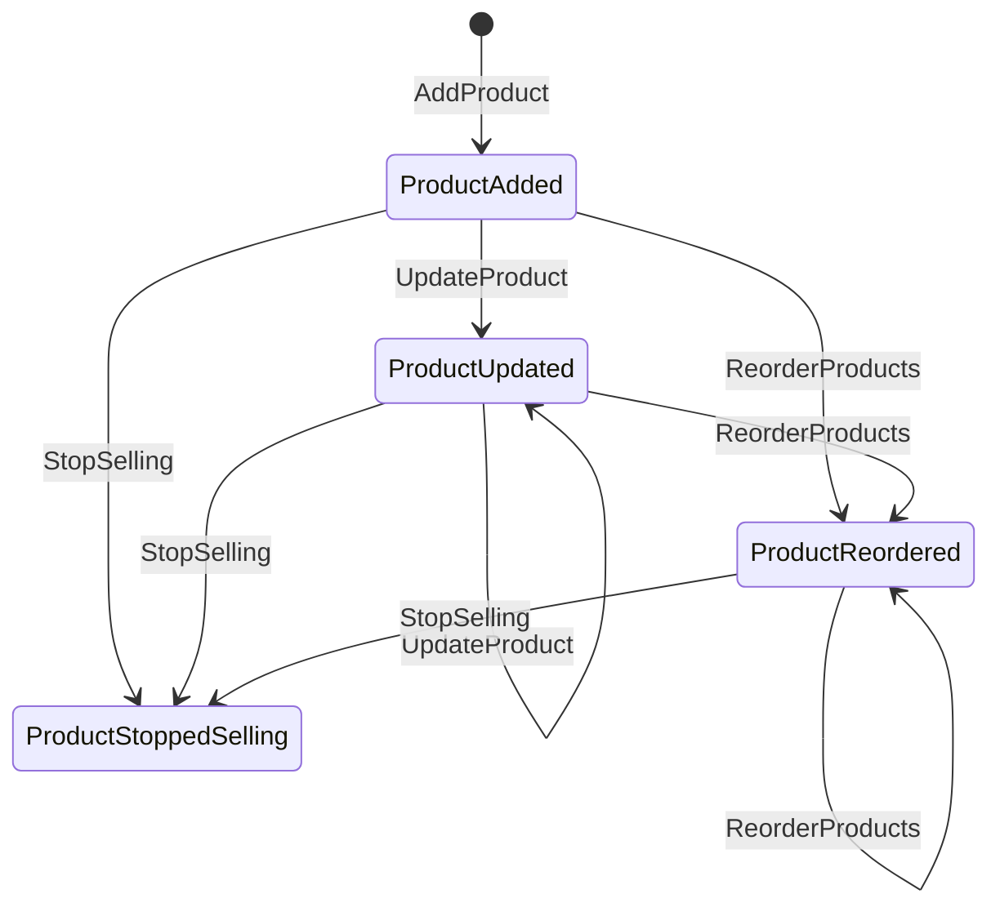

# Aggregate Design Canvas

## 1. Name
**ProductAggregate**

## 2. Description
- このアグリゲートは、相互連動型ダイナミックプライシングシステムにおける商品のライフサイクルを管理します。
- プライシング担当者による価格戦略の実行と、品揃え担当者によるマーチャンダイジング施策を支援する上で、以下の点に重点を置いています：
  - 商品の一意性確保による正確な価格戦略の実現
  - 表示順序の管理による効果的なマーチャンダイジングの実現
  - 商品情報の整合性維持による信頼性の高い運用の実現
- 補完商品の連動（クロスプライシング）や代替商品の需要バランス調整といった、高度な価格戦略の基盤となります。

## 3. State Transitions

## 4. Enforced Invariants & Corrective Policies
Enforced Invariants:
- 商品名は一意であること
- 一度に処理できる商品数は最大10件までであること
- 商品の表示順序が保持されること
- 商品コード、名称、説明、カテゴリは必須項目であること
- 並び替え操作は表示順序の一貫性を維持すること

Corrective Policies:
- 特になし（現状のイベントストーミング図からは是正ポリシーは必要ないと判断）

## 5. Handled Commands & Created Events
| Handled Command  | Created Event     |
|---|----|
| AddProduct      | ProductAdded      |
| UpdateProduct     | ProductUpdated    |
| StopSelling  | ProductStoppedSelling  |
| ReorderProducts | ProductsReordered | 