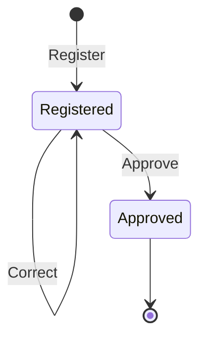

# Aggregate Design Canvas - 仕訳集約

## 1. Name
**JournalEntry**

## 2. Description
- このアグリゲートは、会計システムにおける仕訳のライフサイクル（登録、訂正、承認）を管理します。
- 仕訳は複数の仕訳明細を含み、借方合計と貸方合計が一致する必要があります。
- 仕訳の境界は、会計取引の原子性を保証し、複式簿記の整合性を維持するために選択されました。

## 3. State Transitions

## 4. Enforced Invariants & Corrective Policies
Enforced Invariants:
- 仕訳明細は2行以上存在すること
- 借方合計と貸方合計が一致すること
- 承認済み仕訳は訂正不可能であること
- 各仕訳明細には有効な勘定科目が設定されていること

Corrective Policies:
- 該当なし（すべての不変条件はアグリゲート内で保証される）

## 5. Handled Commands & Created Events
| Handled Command  | Created Event     |
|------------------|-------------------|
| Register         | Registered        |
| Correct          | Corrected         |
| Approve          | Approved          |

## 6. Throughput
|                           | Average | Maximum |
|---------------------------|---------|---------|
| **Command handling rate** | 100 commands/day | 500 commands/day |
| **Total number of clients** | 5 clients | 20 clients |
| **Concurrency conflict chance** | low | medium |

## 7. Size
|                           | Average | Maximum |
|---------------------------|---------|---------|
| **Event growth rate** | 3 events/day | 10 events/day |
| **Lifetime of a single instance** | 365 days | indefinite |
| **Number of events persisted** | small | medium |