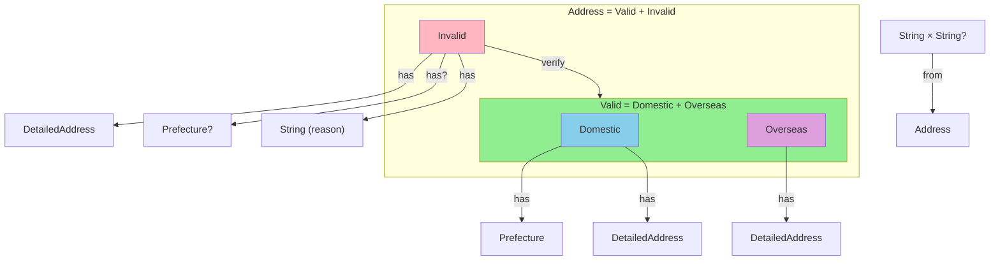

# 住所（Address）ドメインの可換図式

```mermaid
graph TD
    %% 入力
    Input["String × String?"]
    
    %% トップレベル
    Address["Address"]
    
    %% Address のサブ圏
    subgraph Address_Space["Address = Valid + Invalid"]
        subgraph Valid_Space["Valid = Domestic + Overseas"]
            Domestic["Domestic"]
            Overseas["Overseas"]
        end
        Invalid["Invalid"]
    end
    
    %% 基本的な射
    Input -->|"from"| Address
    
    %% 状態遷移
    Invalid -->|"verify"| Valid_Space
    
    %% 構成要素
    Domestic -->|"has"| Pref["Prefecture"]
    Domestic -->|"has"| DA1["DetailedAddress"]
    Overseas -->|"has"| DA2["DetailedAddress"]
    Invalid -->|"has"| DA3["DetailedAddress"]
    Invalid -->|"has?"| PrefOpt["Prefecture?"]
    Invalid -->|"has"| Reason["String (reason)"]
    
    style Valid_Space fill:#90EE90
    style Invalid fill:#FFB6C1  
    style Domestic fill:#87CEEB
    style Overseas fill:#DDA0DD
```