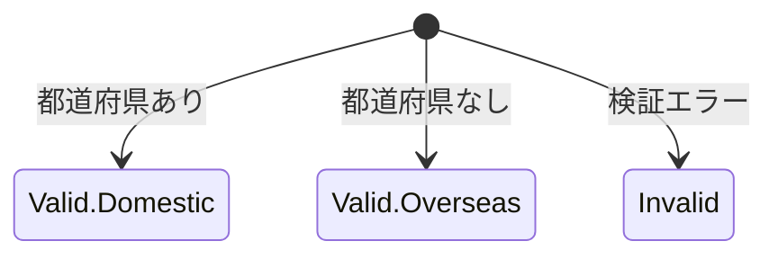

# 住所（Address）

## 概要
配送先となる住所です

## 関連する用語
- 都道府県（Prefecture）
- 住所詳細（DetailedAddress）

## 情報構造
### 住所の分類
- **有効な住所（Valid）**
    - **国内住所（Domestic）**
        - 都道府県
        - 住所詳細
    - **海外住所（Overseas）**
        - 住所詳細（都道府県は持たない）
- **無効な住所（Invalid）**
    - 都道府県（nullable）
    - 住所詳細
    - 無効理由

### 導出プロパティ
- `isDomestic()`: 国内住所かどうかを判定
- `isValid()`: 有効な住所かどうかを判定
- `display()`: 住所の表示形式を提供

## 状態遷移

## 生成と変換
### 文字列からの生成（from）
- 文字列からの変換
  - 「県」&「住所」の文字列情報

## ビジネスルール
### 住所詳細の検証
- 住所詳細は必須（空文字は不可）
- 前後の空白は自動的にトリミング

### 都道府県の解析
- 都道府県が空欄の場合は海外住所として扱う
- 入力された都道府県名は有効な都道府県である必要がある
- 前後の空白は自動的にトリミング

### 住所の生成
- 都道府県が指定されている場合は国内住所
- 都道府県が指定されていない場合は海外住所